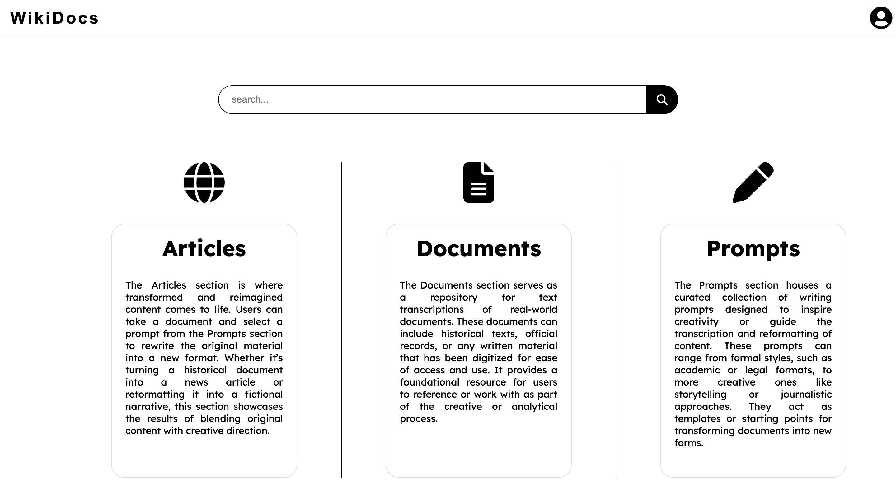

# WikiDocs - Documentation

## Overview



**WikiDocs** is a collaborative web application designed to provide a platform for users to create, edit, and organize knowledge-based content. It functions similarly to Wikipedia, allowing users to contribute and manage articles, documents, and prompts. With a robust CRUD (Create, Read, Update, Delete) functionality, WikiDocs supports a variety of interactions, providing a comprehensive system for knowledge management.

---

## Features

### 1. **User Management**
   - **Create**: Users can create an account and profile on the platform.
   - **Read**: Users can view profiles, articles, and other shared knowledge.
   - **Update**: Users can edit their profiles and manage personal information.
   - **Delete**: Users can deactivate their accounts or remove personal data from the platform.

### 2. **Document Management**
   - **Create**: Users can create new documents, which can be public or private.
   - **Read**: Users can view documents and associated articles.
   - **Update**: Users can edit their own documents to keep information accurate and up-to-date.
   - **Delete**: Users can delete their own documents.

### 3. **Article Management**
   - **Create**: Users can write and publish new articles that contribute to the overall knowledge base.
   - **Read**: Articles can be browsed and read by any user.
   - **Update**: Users can edit their own articles to refine content or correct errors.
   - **Delete**: Users can remove their own articles.

### 4. **Prompt Management**
   - **Create**: Users can create prompts for generating ideas, articles, or documents.
   - **Read**: Users can view prompts that may help guide the creation of new content.
   - **Update**: Users can update their own prompts.
   - **Delete**: Users can delete their own prompts.

---

## User Roles and Permissions

### **Roles Overview**

WikiDocs has two user roles: **Owner** and **Reader**. Both roles have similar permissions but with different levels of access for managing content. 

1. **Owner**
   - **Permissions**: The Owner has full control over the platform, including content management and user administration.
   - **Can**:
     - Create, edit, and delete their own articles, documents, and prompts.
     - View and read all articles, documents, and prompts created by other users.
     - Moderate and delete any content (if required).
     - Manage user accounts (create, edit, delete users).

2. **Reader**
   - **Permissions**: The Reader has basic read-only access to all public content.
   - **Can**:
     - Create, edit, and delete their own articles, documents, and prompts.
     - View all public articles, documents, and prompts created by others.
     - Cannot manage other users or modify content created by others.

### Role-Based Permissions Table:

| Feature/Action               | **Owner** | **Reader** |
|------------------------------|-----------|------------|
| **Create Articles**           | ✅        | ✅         |
| **Edit Articles**             | ✅        | ✅ (Own)   |
| **Delete Articles**           | ✅        | ✅ (Own)   |
| **Create Documents**          | ✅        | ✅         |
| **Edit Documents**            | ✅        | ✅ (Own)   |
| **Delete Documents**          | ✅        | ✅ (Own)   |
| **Create Prompts**            | ✅        | ✅         |
| **Edit Prompts**              | ✅        | ✅ (Own)   |
| **Delete Prompts**            | ✅        | ✅ (Own)   |
| **View All Public Content**   | ✅        | ✅         |
| **View Private Content**      | ✅        | ❌         |
| **Manage Users**              | ✅        | ❌         |

---

## API Endpoints

WikiDocs offers a RESTful API for interacting with the platform programmatically. Below are some of the key endpoints.

### User Endpoints
- `POST /users/register`: Create a new user account.
- `POST /users/login`: Login to the platform.
- `GET /users/{id}`: View a user's profile.
- `PUT /users/{id}`: Update a user's profile information.
- `DELETE /users/{id}`: Deactivate a user account.

### Document Endpoints
- `POST /documents`: Create a new document.
- `GET /documents/{id}`: View a specific document.
- `PUT /documents/{id}`: Update an existing document.
- `DELETE /documents/{id}`: Delete a document.

### Article Endpoints
- `POST /articles`: Create a new article.
- `GET /articles/{id}`: View a specific article.
- `PUT /articles/{id}`: Update an existing article.
- `DELETE /articles/{id}`: Delete an article.

### Prompt Endpoints
- `POST /prompts`: Create a new prompt.
- `GET /prompts/{id}`: View a specific prompt.
- `PUT /prompts/{id}`: Update an existing prompt.
- `DELETE /prompts/{id}`: Delete a prompt.

---

## Technology Stack

WikiDocs is built using modern web technologies to ensure scalability, reliability, and ease of use.

- **Frontend**: React.js, Tailwind CSS
- **Backend**: Flask (Python)
- **Database**: PostgreSQL
- **Authentication**: JWT (JSON Web Tokens)
- **Hosting**: AWS, DigitalOcean

---

## Getting Started

1. Clone the repository:
   ```bash
   git clone https://github.com/yourusername/WikiDocs.git
